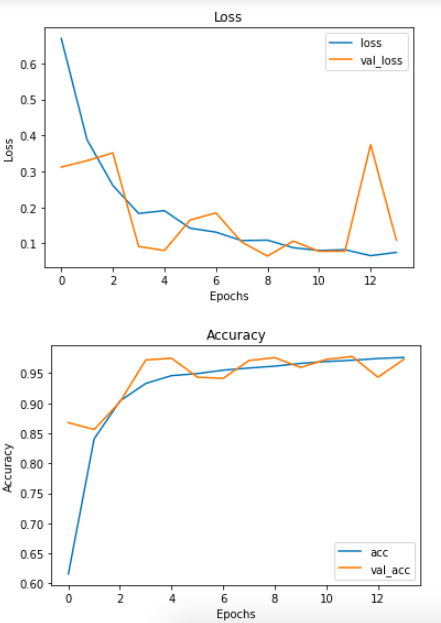
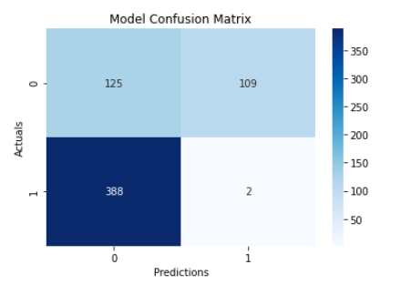

# Using Deep Learning to Detect Pneumonia from X-Rays

## Objectives
***
The objective of this analysis was to build a machine learning model that can detect whether or not a patient has pneumonia by classfiying X-ray images.

## Background Information 
***
According to the [Mayo Clinic Website](https://www.mayoclinic.org/diseases-conditions/pneumonia/symptoms-causes/syc-20354204#:~:text=Pneumonia%20is%20an%20infection%20that,and%20fungi%2C%20can%20cause%20pneumonia.), "Pneumonia is an infection that inflames the air sacs in one or both lungs. The air sacs may fill with fluid or pus (purulent material), causing cough with phlegm or pus, fever, chills, and difficulty breathing. A variety of organisms, including bacteria, viruses and fungi, can cause pneumonia. Pneumonia can range in seriousness from mild to life-threatening. It is most serious for infants and young children, people older than age 65, and people with health problems or weakened immune systems." 

## Data Understanding
***
The x-ray images used for this analysis were obtained from Guangzhou Women and Children’s Medical Center, Guangzhou, China. These x-rays were obtained from pediatric patients ranging from the ages one to five as part of their normal routine care. All images that were of low quality or unreadable were removed and were reviews by three expert physicians for the purpose of AI analysis.

The dataset was organized into 3 folders (test, training, and validation) and within each folders there were subfolders for each category (Pneumonia/Normal). In total there are 5,863 X-Ray images. The dataset was downloaded from the [Kaggle website](https://www.kaggle.com/paultimothymooney/chest-xray-pneumonia).

## Preprocessing
***
For the preprocessing stage of this image classification task, I created data generators of training, testing, validation data using the Keras ImageDataGenerator function. I rescaled the images 1/255. I wanted the pixels for each image to be 128 X 128 so I put that in target_size. I made the class_mode parameter 'binary' since this is a binary problem. I set the batch_size according to the amount of images for each test, training, and validation set.

## Modeling
***
For this analysis, I created a binary CNN (Convolution Neural Network) to classify the X-Ray images. I used classification reports for the models to give me accuracy, loss, recall, precision, and F1 score metrics. I also built a pretrained VGG19 transfer learning to classify the X-Ray Images. You can learn more about VGG19 classification and detection [here](https://keras.io/api/applications/vgg/).

### Model 4:  Best Model Performance

The accuracy curves for this model show an accuracy of about 95%.

The model ended up with an accuracy of 79% when predicting the testing dataset. The confusion matrix for Model 4 is shown above. The model can classify the normal class of images pretty well, however it do not do as well with classifying the pneumonia classes of images.

## Conclusions and Recommendations
***
The best model had an accuracy rate of almost 80%, which is not great, but still pretty good. Most of the models I built had an accuracy of 70% and up. The models most likely need some more hyperparameter tuning and general tuning. My best model is struggles with predicting pneumonia images and is more likely to predict false negatives.

My recommendations would be to use this model as a first opinion. Then professional doctors would be used as a necessary second opinion to finally determine whether or not a patient has pneumonia. I would also recommend training these models on adult X-Ray images, since these images are only of pedatric patients ranging from ages one to five.

## Future Work
***
The X-Ray images still have some organs visible in the image which can confuse the model. If these organs can be cropped out before being included in the image sets, I think that would help the model perform better.

For this image classification, I used 224 X 224 px image sizes initially. This made model training EXTREMELY slow. I lowered the image sizes to 128 X 128 px which improved runtime. With more time, I would have liked to use 64 X 64 px or 32 X 32 px. This would greatly improve runtime and would allow me more time to run other models.

I would also like to research other methods of image classification and do some CNN tuning. I believe that some more preprocessing would help improve the models performance too.
